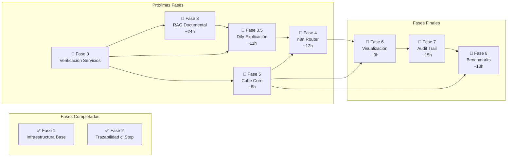

# 🗺️ SDRAG Chainlit - Roadmap de Implementación

**Proyecto:** Arquitectura RAG Híbrida con Capa Semántica Determinista
**Componente:** Frontend Chainlit
**Última actualización:** 19 de Enero, 2026
**Estado general:** ✅ Fase 2 completada - Próxima: Fase 3 (RAG Documental con Weaviate) + Fase 3.5 (Dify)

---

## 📋 Resumen Ejecutivo

Este documento define el roadmap de implementación del frontend **Chainlit** para el proyecto SDRAG (Structured Data Retrieval Augmented Generation). Chainlit actúa como la **consola analítica determinista** del sistema, proporcionando:

- Interfaz conversacional para usuarios FP&A
- Visualización de resultados con trazabilidad completa (`cl.Step`)
- Renderizado de DataFrames, SQL visible y gráficos Plotly
- Integración con el router n8n para clasificación de consultas

---

## 🎯 Objetivo del Componente Chainlit

Chainlit es el **punto de entrada del usuario** en la arquitectura SDRAG:

```
Usuario → Chainlit → n8n (clasificación determinista)
    ↓
    ├─ Semántica (métricas/agregaciones): Cube Core → DuckDB → JSON
    ├─ Documental (contexto textual): Weaviate → Chunks
    └─ Híbrida (datos + contexto): Cube Core → Weaviate → Combinación
    ↓
    Dify (explicación post-cálculo)
    ↓
    Chainlit (cl.Step + DataFrame + SQL + Gráfico)
```

**Principio clave:** Dify recibe **datos ya calculados** y solo genera explicaciones en lenguaje natural. NO participa en clasificación, generación de SQL, ni cálculos numéricos.

**Weaviate como única base vectorial:** Simplificación arquitectónica deliberada para recursos académicos. GraphRAG limitado a 1-2 saltos mediante cross-references entre clases.

**Responsabilidades:**

1. Recibir consultas en lenguaje natural
2. Enviar consultas al router n8n para clasificación determinista (3 rutas)
3. Recibir datos de Cube Core/Weaviate + explicación de Dify
4. Renderizar resultados de forma determinista (SQL + datos + explicación)
5. Proveer trazabilidad completa de cada paso con `cl.Step`
6. Mostrar visualizaciones FP&A (DataFrames, gráficos Plotly)

---

## 📂 Estructura de Documentación

Este documento es el **índice de alto nivel**. Los detalles técnicos para implementación están en la carpeta `roadmap/`:

| Fase | Archivo de Detalles                                                    | Estado          |
| ---- | ---------------------------------------------------------------------- | --------------- |
| 0    | [roadmap/fase-0-infraestructura.md](roadmap/fase-0-infraestructura.md) | 🔧 Verificación |
| 3    | [roadmap/fase-3-rag-documental.md](roadmap/fase-3-rag-documental.md)   | 🚧 Próxima      |
| 3.5  | [roadmap/fase-3.5-dify.md](roadmap/fase-3.5-dify.md)                   | 🚧 Crítica      |
| 4    | [roadmap/fase-4-n8n-router.md](roadmap/fase-4-n8n-router.md)           | 📝 Listo        |
| 5    | [roadmap/fase-5-cube-core.md](roadmap/fase-5-cube-core.md)             | 📝 Listo        |
| 8    | [roadmap/fase-8-benchmarks.md](roadmap/fase-8-benchmarks.md)           | 📝 Listo        |
| Post | [roadmap/comercializacion.md](roadmap/comercializacion.md)             | 📅 Futuro       |

**Para agentes LLM**:

1. **PRIMERO** ejecutar Fase 0 para verificar infraestructura
2. Leer el archivo de detalles antes de implementar cada fase
3. Cada fase tiene sección de **Prerrequisitos** - verificar antes de comenzar
4. Verificar columna **Depende de** en cada tarea antes de comenzar

### 📈 Diagrama de Dependencias entre Fases



**Tiempo total estimado:** ~92 horas de desarrollo

---

## 📊 Fases de Implementación

### ✅ Fase 1: Infraestructura Base (COMPLETADA)

| ID  | Tarea                                            | Estado        | Fecha    |
| --- | ------------------------------------------------ | ------------- | -------- |
| 1.1 | Crear proyecto con `uv` y `pyproject.toml`       | ✅ Completado | Dic 2025 |
| 1.2 | Configurar Dockerfile para despliegue en Coolify | ✅ Completado | Dic 2025 |
| 1.3 | Integrar OpenRouter como proveedor de LLM        | ✅ Completado | Dic 2025 |
| 1.4 | Desplegar en `https://chainlit.sdrag.com`        | ✅ Completado | Dic 2025 |
| 1.5 | Implementar autenticación con password           | ✅ Completado | Dic 2025 |
| 1.6 | Personalizar tema (colores azules del logo)      | ✅ Completado | Dic 2025 |
| 1.7 | Configurar logos y branding SDRAG                | ✅ Completado | Dic 2025 |

**Entregables Fase 1:**

- Chat funcional conectado a OpenRouter
- Autenticación por usuario/password
- Tema personalizado azul
- Despliegue automático vía GitHub → Coolify

---

### ✅ Fase 2: Trazabilidad con `cl.Step` (COMPLETADA)

**Objetivo:** Implementar visualización de pasos de ejecución para auditoría completa.

| ID  | Tarea                                       | Estado        | Prioridad |
| --- | ------------------------------------------- | ------------- | --------- |
| 2.1 | Implementar estructura base de `cl.Step`    | ✅ Completado | Alta      |
| 2.2 | Mostrar paso de "Clasificación de consulta" | ✅ Completado | Alta      |
| 2.3 | Mostrar paso de "Generación de SQL" (mock)  | ✅ Completado | Alta      |
| 2.4 | Mostrar paso de "Ejecución de datos" (mock) | ✅ Completado | Alta      |
| 2.5 | Mostrar paso de "Generación de explicación" | ✅ Completado | Alta      |
| 2.6 | Agregar timestamps y duración por paso      | ✅ Completado | Media     |

**Entregables Fase 2:**

- 4 pasos de trazabilidad visibles (Clasificación → SQL → Datos → Explicación)
- Tiempos de ejecución por paso
- Datos mock FP&A funcionando
- Clasificación por keywords

---

### 🚧 Fase 3: RAG Documental (Weaviate + Docling) - PRÓXIMA

> **Detalles de implementación**: Ver [roadmap/fase-3-rag-documental.md](roadmap/fase-3-rag-documental.md)

**Objetivo:** Permitir subir documentos PDF/Excel y consultarlos mediante búsqueda híbrida en Weaviate.

**¿Por qué Weaviate como única base vectorial?**

- **Simplicidad arquitectónica**: Un único punto de acceso para contexto documental
- **Trazabilidad mejorada**: Toda consulta documental se resuelve en un único sistema
- **Mantenimiento reducido**: Un solo sistema vectorial (backups, actualizaciones, monitoreo)
- **Recursos limitados**: Infraestructura académica (3 nodos) se beneficia de consolidación
- **GraphRAG implícito**: Cross-references entre clases (Document, Chunk, MetricDefinition)

| ID  | Tarea                                                             | Estado       | Prioridad | Depende de | Tiempo |
| --- | ----------------------------------------------------------------- | ------------ | --------- | ---------- | ------ |
| 3.1 | Implementar upload de archivos en Chainlit                        | ⬜ Pendiente | Alta      | -          | 2h     |
| 3.2 | Integrar Docling para extracción estructural de PDFs              | ⬜ Pendiente | Alta      | 3.1        | 4h     |
| 3.3 | Implementar chunking semántico (HybridChunker θ=0.8)              | ⬜ Pendiente | Alta      | 3.2        | 3h     |
| 3.4 | Generar embeddings con Ollama (nomic-embed-text)                  | ⬜ Pendiente | Alta      | 3.3        | 2h     |
| 3.5 | Configurar schema de Weaviate (Document, Chunk, MetricDefinition) | ⬜ Pendiente | Alta      | -          | 2h     |
| 3.6 | Implementar búsqueda híbrida (vectorial + BM25)                   | ⬜ Pendiente | Alta      | 3.4, 3.5   | 4h     |
| 3.7 | Mostrar fuentes citadas con metadata                              | ⬜ Pendiente | Media     | 3.6        | 2h     |
| 3.8 | Preservación de tablas como unidades indivisibles                 | ⬜ Pendiente | Media     | 3.3        | 2h     |
| 3.9 | Implementar cross-references para GraphRAG ligero                 | ⬜ Pendiente | Media     | 3.5        | 3h     |

**Arquitectura del flujo documental:**

```
INGESTA:
Usuario sube PDF → Docling (extracción) → HybridChunker (chunking)
    → Embeddings (Ollama) → Weaviate (indexación con cross-references)

CONSULTA:
Usuario pregunta → Clasificación → Weaviate (búsqueda híbrida)
    → Chunks relevantes + metadata → Dify (explicación) → Respuesta
```

**Schema de Weaviate:**

```
Clases:
- Document: Documentos fuente (PDFs, reportes, papers)
- Chunk: Fragmentos semánticos extraídos de documentos
- MetricDefinition: Definiciones de métricas de Cube Core
- BusinessRule: Reglas de negocio y políticas de cálculo

Cross-references (GraphRAG ligero):
- Chunk → belongsTo → Document
- MetricDefinition → referencedIn → Document
- Chunk → defines → MetricDefinition
- BusinessRule → appliesTo → MetricDefinition
```

**Servicios requeridos:**

- Weaviate: `http://100.110.109.43:8080` (Mac Mini)
- Embeddings: Ollama (nomic-embed-text en VOSTRO)
- Docling: Servicio en VOSTRO (32GB RAM para procesamiento de PDFs)

---

### 🚧 Fase 3.5: Capa de Explicación (Dify) - CRÍTICA

> **Detalles de implementación**: Ver [roadmap/fase-3.5-dify.md](roadmap/fase-3.5-dify.md)

**Objetivo:** Integrar Dify como servicio de explicación post-cálculo, reemplazando las llamadas directas a OpenRouter.

**¿Por qué esta fase es crítica?**

- Dify es el componente central de la arquitectura SDRAG para explicaciones
- Permite versionado y evaluación de prompts
- Separa completamente la generación de explicaciones de los cálculos deterministas
- Habilita métricas de Explanation Consistency para la tesis

| ID    | Tarea                                               | Estado       | Prioridad | Depende de   | Tiempo |
| ----- | --------------------------------------------------- | ------------ | --------- | ------------ | ------ |
| 3.5.1 | Verificar Dify operativo en Mac Mini                | ⬜ Pendiente | Alta      | Fase 0       | 30m    |
| 3.5.2 | Crear aplicación en Dify para explicaciones FP&A    | ⬜ Pendiente | Alta      | 3.5.1        | 1h     |
| 3.5.3 | Implementar cliente HTTP para Dify API              | ⬜ Pendiente | Alta      | 3.5.2        | 2h     |
| 3.5.4 | Enviar datos deterministas (JSON) + contexto a Dify | ⬜ Pendiente | Alta      | 3.5.3        | 2h     |
| 3.5.5 | Recibir explicación en lenguaje natural             | ⬜ Pendiente | Alta      | 3.5.4        | 1h     |
| 3.5.6 | Renderizar explicación en cl.Step "Explicación"     | ⬜ Pendiente | Alta      | 3.5.5        | 2h     |
| 3.5.7 | Implementar fallback a OpenRouter si Dify falla     | ⬜ Pendiente | Media     | 3.5.3        | 2h     |
| 3.5.8 | Medir latencia de Dify vs OpenRouter                | ⬜ Pendiente | Media     | 3.5.6, 3.5.7 | 1h     |

**Flujo de integración Dify:**

```
n8n (Resultados Validados) → Dify API (Explicación) → Chainlit (Renderizado)

Payload a Dify:
{
  "query": "¿Cuál fue el revenue de Q4 2024?",
  "data": {"revenue": 1200000, "period": "Q4 2024"},
  "sql": "SELECT SUM(revenue) FROM facts WHERE quarter = 'Q4' AND year = 2024",
  "context": "Datos provenientes de Cube Core, validados por DuckDB"
}

Respuesta de Dify:
{
  "explanation": "El revenue de Q4 2024 fue de $1.2M..."
}
```

**Principios de Dify en SDRAG:**

- ❌ NO clasifica consultas (responsabilidad de n8n)
- ❌ NO genera SQL (responsabilidad de Cube Core)
- ❌ NO modifica datos numéricos (inmutables)
- ✅ SÍ genera explicaciones en lenguaje natural
- ✅ SÍ permite versionado de prompts
- ✅ SÍ habilita métricas de consistencia

**Servicios requeridos:**

- Dify: `http://100.110.109.43:80` (Mac Mini)
- API Key de aplicación Dify

---

### 📅 Fase 4: Integración con n8n Router

> **Detalles de implementación**: Ver [roadmap/fase-4-n8n-router.md](roadmap/fase-4-n8n-router.md)

**Objetivo:** Conectar Chainlit con el router determinista n8n para clasificación real de consultas (3 rutas).

| ID  | Tarea                                                                  | Estado       | Prioridad | Depende de | Tiempo |
| --- | ---------------------------------------------------------------------- | ------------ | --------- | ---------- | ------ |
| 4.1 | Crear webhook handler para enviar consultas a n8n                      | ⬜ Pendiente | Alta      | Fase 3.5   | 2h     |
| 4.2 | Implementar clasificación con 3 rutas (semántica, documental, híbrida) | ⬜ Pendiente | Alta      | 4.1        | 4h     |
| 4.3 | Manejar respuestas JSON estructuradas de n8n                           | ⬜ Pendiente | Alta      | 4.2        | 2h     |
| 4.4 | Implementar timeout y manejo de errores                                | ⬜ Pendiente | Media     | 4.3        | 1h     |
| 4.5 | Lógica de consultas híbridas (Cube + Weaviate)                         | ⬜ Pendiente | Media     | 4.2, 5.1   | 3h     |

**Rutas de clasificación:**

1. **Semántica** (métricas, agregaciones) → Cube Core → DuckDB
2. **Documental** (contexto textual, definiciones) → Weaviate
3. **Híbrida** (datos + contexto) → Cube Core primero, Weaviate para enriquecer

---

### 📅 Fase 5: Integración con Cube Core

> **Detalles de implementación**: Ver [roadmap/fase-5-cube-core.md](roadmap/fase-5-cube-core.md)

**Objetivo:** Conectar directamente con la capa semántica para consultas SQL deterministas.

| ID  | Tarea                                       | Estado       | Prioridad | Depende de | Tiempo |
| --- | ------------------------------------------- | ------------ | --------- | ---------- | ------ |
| 5.1 | Implementar cliente HTTP para Cube Core API | ⬜ Pendiente | Alta      | Fase 0     | 3h     |
| 5.2 | Parsear respuestas de métricas Cube         | ⬜ Pendiente | Alta      | 5.1        | 2h     |
| 5.3 | Mostrar SQL canónico generado por Cube      | ⬜ Pendiente | Alta      | 5.2        | 1h     |
| 5.4 | Cachear resultados frecuentes (Redis)       | ⬜ Pendiente | Baja      | 5.1        | 2h     |

**Métricas FP&A disponibles en Cube Core:**

- `Revenue`, `COGS`, `GrossMargin`, `OPEX`, `EBITDA`, `NetIncome`

---

### 📅 Fase 6: Visualización Avanzada

> **Detalles de implementación**: Ver [roadmap/fase-6-visualizacion.md](roadmap/fase-6-visualizacion.md) _(pendiente de crear)_

**Objetivo:** DataFrames interactivos y gráficos Plotly para análisis FP&A.

| ID  | Tarea                              | Estado       | Prioridad | Depende de | Tiempo |
| --- | ---------------------------------- | ------------ | --------- | ---------- | ------ |
| 6.1 | Paginación para tablas grandes     | ⬜ Pendiente | Media     | 5.2        | 2h     |
| 6.2 | Gráficos de línea (tendencias)     | ⬜ Pendiente | Alta      | 5.2        | 3h     |
| 6.3 | Gráficos de barras (comparaciones) | ⬜ Pendiente | Alta      | 5.2        | 2h     |
| 6.4 | Auto-detectar tipo de gráfico      | ⬜ Pendiente | Baja      | 6.2, 6.3   | 2h     |

**Código de referencia para gráficos Plotly:**

```python
import plotly.express as px
import chainlit as cl

async def render_chart(data: dict, chart_type: str = "line"):
    """Renderiza gráfico Plotly en Chainlit."""
    df = pd.DataFrame(data)

    if chart_type == "line":
        fig = px.line(df, x="period", y="value", title="Tendencia")
    elif chart_type == "bar":
        fig = px.bar(df, x="category", y="value", title="Comparación")

    # Chainlit soporta Plotly directamente
    await cl.Message(content="", elements=[
        cl.Plotly(name="chart", figure=fig)
    ]).send()
```

**Tipos de visualización por métrica:**

- **Revenue, EBITDA, NetIncome** → Gráfico de línea (tendencias temporales)
- **Comparaciones YoY, MoM** → Gráfico de barras (lado a lado)
- **Ratios, Márgenes** → Gauge o indicadores

---

### 📅 Fase 7: Audit Trail y Exportación

> **Detalles de implementación**: Ver [roadmap/fase-7-audit-trail.md](roadmap/fase-7-audit-trail.md) _(pendiente de crear)_

**Objetivo:** Permitir exportar trazas de ejecución para auditoría financiera completa.

| ID  | Tarea                              | Estado       | Prioridad | Depende de | Tiempo |
| --- | ---------------------------------- | ------------ | --------- | ---------- | ------ |
| 7.1 | Exportar sesión a JSON             | ⬜ Pendiente | Media     | Fase 6     | 2h     |
| 7.2 | Exportar sesión a PDF              | ⬜ Pendiente | Baja      | 7.1        | 3h     |
| 7.3 | Guardar historial en base de datos | ⬜ Pendiente | Baja      | 7.1        | 4h     |
| 7.4 | Dashboard de métricas de uso       | ⬜ Pendiente | Baja      | 7.3        | 6h     |

**Estructura del JSON de sesión:**

```json
{
  "session_id": "uuid",
  "timestamp": "2026-01-20T10:00:00Z",
  "user": "hector",
  "queries": [
    {
      "query": "¿Cuál fue el revenue de Q4 2024?",
      "classification": { "route": "semantic", "metric": "revenue" },
      "sql": "SELECT SUM(revenue) FROM facts WHERE quarter='Q4'",
      "data": { "revenue": 1200000 },
      "explanation": "El revenue de Q4 2024 fue de $1.2M...",
      "latency_ms": 1450,
      "source": "dify"
    }
  ]
}
```

**Valor para auditoría FP&A:**

- Trazabilidad completa: pregunta → SQL → datos → explicación
- Reproducibilidad: mismo input genera mismo output numérico
- Compliance: registro de quién consultó qué y cuándo

---

### 📅 Fase 8: Evaluación de Benchmarks

> **Detalles de implementación**: Ver [roadmap/fase-8-benchmarks.md](roadmap/fase-8-benchmarks.md)

**Objetivo:** Interfaz para ejecutar y visualizar resultados de benchmarks.

| ID  | Tarea                                  | Estado       | Prioridad | Depende de | Tiempo |
| --- | -------------------------------------- | ------------ | --------- | ---------- | ------ |
| 8.1 | Modo "benchmark" para ejecución masiva | ⬜ Pendiente | Alta      | Fase 5     | 4h     |
| 8.2 | Mostrar métricas de Execution Accuracy | ⬜ Pendiente | Alta      | 8.1        | 3h     |
| 8.3 | Comparar resultados: LLM solo vs SDRAG | ⬜ Pendiente | Alta      | 8.2        | 4h     |
| 8.4 | Visualizar latencias (P50, P95, P99)   | ⬜ Pendiente | Media     | 8.1        | 2h     |

---

## 📈 Métricas de Éxito del Componente

### Métricas Operativas (Chainlit)

| Métrica                       | Objetivo                             | Estado Actual    |
| ----------------------------- | ------------------------------------ | ---------------- |
| **Traceability Completeness** | 100% de consultas con pasos visibles | ✅ 100% (Fase 2) |
| **Latencia UI**               | < 2s para queries simples (p50)      | ✅ ~1.5s         |
| **Disponibilidad**            | 99% uptime                           | ✅ Funcionando   |
| **Autenticación**             | 100% de accesos autenticados         | ✅ Implementado  |

### Métricas del Protocolo de Investigación (Tesis)

| Métrica                            | Objetivo                         | Estado Actual           |
| ---------------------------------- | -------------------------------- | ----------------------- |
| **Execution Accuracy (EX)**        | >95% (vs ~60% baseline)          | ⬜ Pendiente (Fase 8)   |
| **Query Routing Accuracy**         | >98%                             | ⬜ Pendiente (Fase 4)   |
| **Numerical Hallucination Rate**   | <5%                              | ⬜ Pendiente (Fase 5)   |
| **Explanation Consistency (Dify)** | Medir con BLEU/ROUGE             | ⬜ Pendiente (Fase 3.5) |
| **Latencia End-to-End**            | <2s (p50), <5s (p95)             | ⬜ Pendiente            |
| **Document RAG Activation Rate**   | Medir % de consultas Weaviate    | ⬜ Pendiente (Fase 3)   |
| **Retrieval Precision**            | Relevancia de chunks recuperados | ⬜ Pendiente (Fase 3)   |

---

## 🧪 Política de Testing

Cada fase debe incluir tests que validen su funcionamiento antes de marcarla como completada.

### Estructura de Tests

```
tests/
├── conftest.py              # Fixtures compartidos (mocks de Dify, Weaviate, etc.)
├── test_classification.py   # Tests de classify_query()
├── test_dify_client.py      # Tests de call_dify() y fallback
├── test_weaviate.py         # Tests de indexación y búsqueda híbrida
├── test_embeddings.py       # Tests de generación de embeddings
└── test_integration.py      # Tests end-to-end de flujos completos
```

### Comandos

```bash
# Ejecutar todos los tests
pytest

# Ejecutar tests de una fase específica
pytest tests/test_dify_client.py      # Fase 3.5
pytest tests/test_weaviate.py         # Fase 3

# Ejecutar con coverage
pytest --cov=. --cov-report=html
```

### Principios

1. **Mocks para servicios externos**: Nunca llamar a Dify, Weaviate u Ollama reales en tests unitarios
2. **Fixtures compartidos**: Usar `conftest.py` para datos mock reutilizables
3. **Tests por fase**: Cada archivo `fase-X.md` incluye una tarea de tests específica
4. **Coverage mínimo**: 80% en funciones críticas (`call_dify`, `hybrid_search`, `classify_query`)

### Tests por Fase

| Fase | Archivo de Tests                         | Cobertura Objetivo                 |
| ---- | ---------------------------------------- | ---------------------------------- |
| 3    | `test_weaviate.py`, `test_embeddings.py` | Indexación, búsqueda híbrida       |
| 3.5  | `test_dify_client.py`                    | `call_dify()`, fallback, latencias |
| 4    | `test_n8n_router.py`                     | Clasificación, webhook handler     |
| 5    | `test_cube_client.py`                    | Cliente Cube Core, parsing         |

---

## 🔧 Variables de Entorno Requeridas

```bash
# Autenticación
CHAINLIT_AUTH_SECRET=<clave-secreta-larga>
CHAINLIT_USER=<usuario>
CHAINLIT_PASSWORD=<password>

# Dify - Capa de Explicación (Fase 3.5) - PRIMARIO
DIFY_API_URL=http://100.110.109.43:80/v1
DIFY_API_KEY=app-xxx

# OpenRouter - Fallback/Desarrollo
OPENROUTER_API_KEY=<api-key>
OPENROUTER_MODEL=mistralai/devstral-2512:free

# RAG Documental - Weaviate (Fase 3)
WEAVIATE_URL=http://100.110.109.43:8080
WEAVIATE_API_KEY=<opcional>

# Embeddings (Ollama en VOSTRO)
OLLAMA_BASE_URL=http://100.116.107.52:11434
EMBEDDING_MODEL=nomic-embed-text

# Procesamiento Distribuido (Dask)
DASK_SCHEDULER_URL=tcp://100.105.68.15:8786

# Integraciones (Fase 4-5)
N8N_WEBHOOK_URL=http://100.105.68.15:5678/webhook/sdrag-query
CUBE_API_URL=http://100.116.107.52:4000
```

---

## 🚀 Comercialización (Post-Tesis)

> **Documento separado**: [roadmap/comercializacion.md](roadmap/comercializacion.md)

Este proyecto tiene potencial de convertirse en un producto SaaS para equipos FP&A. Las fases de comercialización están documentadas por separado para no mezclar objetivos académicos con objetivos de negocio.

### Resumen de Fases de Comercialización

| Fase | Descripción                           | Prioridad |
| ---- | ------------------------------------- | --------- |
| C1   | Multi-tenancy y aislamiento de datos  | Crítica   |
| C2   | Autenticación empresarial (OAuth/SSO) | Crítica   |
| C3   | Integración Stripe (suscripciones)    | Alta      |
| C4   | Compliance y seguridad (SOC 2)        | Alta      |
| C5   | Infraestructura escalable             | Media     |
| C6   | Onboarding y self-service             | Media     |

**Prerrequisito**: Completar Fases 1-8 (tesis) antes de iniciar comercialización.

---

## 📚 Referencias

- [Protocolo de Investigación](documentos_de_referencia_tesis/Protocolo_MCD_2025_Hector_Sanchez_v7_Weaviate.md)
- [Arquitectura del Sistema](documentos_de_referencia_tesis/ARQUITECTURA.md)
- [Información de Infraestructura](documentos_de_referencia_tesis/tailscale-computers-info.md)
- [Documentación Chainlit](https://docs.chainlit.io)
- [Documentación Dify](https://docs.dify.ai)
- [Documentación Weaviate](https://weaviate.io/developers/weaviate)

---

## 📝 Changelog

| Fecha      | Versión | Cambios                                                                                                                                               |
| ---------- | ------- | ----------------------------------------------------------------------------------------------------------------------------------------------------- |
| 2026-01-20 | 1.1.0   | Agregar dependencias explícitas y estimaciones de tiempo a todas las tareas + Diagrama de dependencias Mermaid                                        |
| 2026-01-19 | 1.0.0   | **BREAKING**: Alinear con protocolo v7 - Weaviate como única base vectorial, eliminar Neo4j/OpenSearch/Qdrant, simplificar a 3 rutas de clasificación |
| 2026-01-18 | 0.8.0   | Agregar Fase 3.6 (Neo4j GraphRAG) + Qdrant + Dask + Métricas GraphRAG + 4 rutas de clasificación                                                      |
| 2026-01-18 | 0.7.0   | Agregar roadmap de comercialización (post-tesis)                                                                                                      |
| 2026-01-18 | 0.6.0   | Agregar política de testing y estructura tests/                                                                                                       |
| 2026-01-18 | 0.5.0   | Crear carpeta roadmap/ con detalles de implementación para LLMs                                                                                       |
| 2026-01-18 | 0.4.0   | Agregar Fase 3.5 (Dify) + Actualizar flujo arquitectura + Dify como capa de explicación                                                               |
| 2025-12-21 | 0.3.0   | Fase 2 trazabilidad + Reorganizar RAG a Fase 3 + traducciones es-ES                                                                                   |
| 2025-12-21 | 0.2.0   | Autenticación + Tema azul                                                                                                                             |
| 2025-12-21 | 0.1.0   | Chat básico con OpenRouter                                                                                                                            |

---

_Documento generado para tracking del proyecto SDRAG Chainlit_
_Maestría en Ciencia de los Datos - Universidad de Guadalajara_
