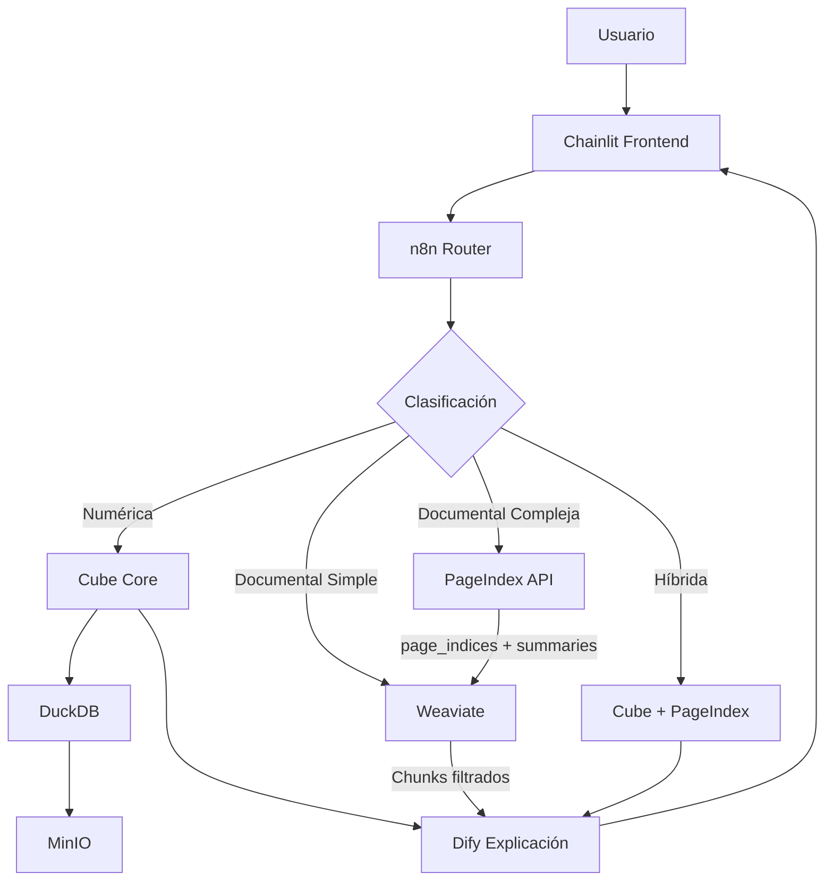

## UNIVERSIDAD DE GUADALAJARA

## CENTRO UNIVERSITARIO DE CIENCIAS ECONÓMICO ADMINISTRATIVAS

## COORDINACIÓN DE POSGRADO

## MAESTRÍA EN CIENCIA DE LOS DATOS

<!-- image -->

Protocolo de Investigación
Arquitectura RAG Híbrida con Capa Semántica Determinista (SDRAG) para Reducir Alucinaciones Aritméticas en Analítica Financiera (FP&A)

## P R E S E N T A

## HECTOR GABRIEL SANCHEZ PEREZ

Enero 19, 2026
www.cfocoder.com
hector@sanchezmx.com
+52 (33) 1286-6700

<!-- image -->

<!-- image -->

---

## 1. Título

**Arquitectura RAG Híbrida con Capa Semántica Determinista para Reducir Alucinaciones Aritméticas en Sistemas de IA Generativa aplicados a Analítica Financiera (FP&A)**

---

## 2. Planteamiento del Problema

Los Grandes Modelos de Lenguaje (LLMs) han demostrado capacidades excepcionales en tareas de procesamiento de lenguaje natural, pero presentan limitaciones críticas al interactuar con datos estructurados, especialmente en contextos financieros donde la precisión numérica es imperativa.

### 2.1 Descripción del Problema

La integración de LLMs en procesos de Planificación y Análisis Financiero (FP&A) enfrenta desafíos fundamentales que limitan su adopción en entornos corporativos:

1. **Alucinaciones Aritméticas**: Los LLMs, por su naturaleza estocástica, generan cálculos incorrectos y resultados financieros inexactos. La literatura científica documenta tasas de error del ~40% en tareas Text-to-SQL sin asistencia estructural (Spider Benchmark baseline).

2. **Degradación en Text-to-SQL Directo**: Estudios recientes (FinanceBench 2023) reportan tasas de falla superiores al 80% en preguntas financieras que requieren precisión numérica con GPT-4-Turbo y RAG tradicional, evidenciando la insuficiencia de los enfoques vectoriales puros.

3. **Opacidad en Decisiones de Ejecución**: Los sistemas actuales (OpenWebUI, copilots genéricos) delegan en el LLM la decisión de **qué ejecutar y cómo**, generando rutas de ejecución implícitas y no auditables.

4. **Falta de Trazabilidad**: La ausencia de registro explícito de pasos de ejecución (SQL generado, datos recuperados, cálculos intermedios) impide la validación forense necesaria en auditorías financieras.

### 2.2 Pregunta de Investigación

¿Puede una arquitectura de **ejecución determinista con explicación asistida por lenguaje** (SDRAG) reducir significativamente las alucinaciones aritméticas en sistemas de IA generativa aplicados a analítica financiera, comparada con enfoques Text-to-SQL directos y RAG tradicionales?

**Pregunta Secundaria**: ¿Es el paradigma Headless BI (capa semántica como API + UI intercambiable) una arquitectura viable para garantizar reproducibilidad en experimentos académicos y aplicabilidad en producción simultáneamente?

### 2.3 Delimitación del Alcance

- **Temporal**: Desarrollo durante 4 semestres académicos (2025-2027).
- **Espacial**: Infraestructura distribuida híbrida (Oracle Cloud ARM64 + laboratorio local x86 en Guadalajara, México).
- **Técnica**: Framework SDRAG con validación mediante benchmarks estándar (Spider, BIRD, FinQA, TAT-QA, FinanceBench).
- **Dominio**: Analítica financiera (FP&A) como caso de estudio, con arquitectura agnóstica al dominio para permitir generalización.
- **Limitaciones Explícitas**:
  - No implementa alta disponibilidad (HA) ni replicación multi-nodo.
  - Infraestructura limitada a 3 nodos físicos disponibles.
  - Prioriza precisión y trazabilidad sobre escalabilidad industrial completa.

---

## 3. Justificación

### 3.1 Relevancia Académica

Este proyecto contribuye al campo emergente de **arquitecturas de IA con ejecución determinística** al proponer un modelo que combina:

- **Generación flexible** (LLMs) para interpretación de lenguaje natural y generación de explicaciones post-cálculo.
- **Ejecución determinística** (Capa Semántica vía Cube Core) para garantizar precisión numérica y reproducibilidad.
- **Clasificación explícita** (n8n con reglas determinísticas) para control de flujo auditable.

**Nota conceptual**: El determinismo se aplica a nivel de **ejecución de cálculos**, no a la generación lingüística del LLM. El modelo estocástico solo genera explicaciones sobre resultados ya validados.

**Vacío en la Literatura**: La investigación actual en RAG se enfoca en recuperación de documentos no estructurados. Existe escasa literatura sobre arquitecturas de producción para LLMs en contextos de alta sensibilidad numérica (finanzas, salud, infraestructura crítica) que garanticen trazabilidad completa.

**Diferenciación vs. Estado del Arte**:

| Dimensión | RAG Tradicional | SDRAG (Propuesto) |
|-----------|-----------------|-------------------|
| **Generación de números** | LLM genera valores | ❌ Prohibido - Solo capa semántica |
| **SQL** | Generado por LLM (estocástico) | ✅ Determinista vía Cube Core |
| **Ruta de ejecución** | Decidida por LLM | ✅ Reglas + Clasificador ligero (n8n) |
| **Explicación** | LLM genera explicación + datos | ✅ Dify solo explica datos validados |
| **Contexto documental** | Múltiples vector stores | ✅ Weaviate única (simplificación deliberada) |
| **Navegación documental** | Chunking tradicional | ✅ PageIndex (indexación jerárquica) |
| **Trazabilidad** | Parcial (prompt → respuesta) | ✅ Completa (SQL + datos + pasos) |
| **Reproducibilidad** | Baja (temperatura ≠ 0) | ✅ Alta (mismo input → mismo output) |
| **Riesgo de alucinación aritmética** | Alto (~40% error) | ✅ Bajo por diseño arquitectónico |

**Nota sobre Dify**: En SDRAG, Dify actúa exclusivamente como **capa de explicación post-cálculo**. Recibe resultados ya validados por Cube Core y genera explicaciones en lenguaje natural sin modificar datos ni participar en decisiones de enrutamiento. Esta separación estricta es clave para mantener el determinismo arquitectónico.

### 3.2 Relevancia Profesional

El investigador posee 30+ años de experiencia en analítica financiera corporativa (KPMG, Motorola, HP, OpenText, Weave Communications), proporcionando:

- **Conocimiento del dominio** para validar casos de uso realistas de FP&A.
- **Acceso a procesos** para fundamentar requisitos técnicos (cierres contables, análisis de varianza, forecasting).
- **Capacidad de implementación** en infraestructura auto-hospedada con presupuesto académico (~$0-150 USD).

### 3.3 Impacto Esperado

**Sector Académico**:
- Establecimiento de metodología reproducible para evaluación de LLMs en datos estructurados.
- Protocolo de métricas explícito (Execution Accuracy, Query Routing Accuracy, Numerical Hallucination Rate, Traceability Completeness, Explanation Consistency) que otros investigadores pueden replicar.
- Contribución al estado del arte en arquitecturas RAG híbridas con navegación documental jerárquica.

**Sector Empresarial**:
- Reducción de costos de infraestructura (arquitectura auto-hospedada vs. servicios cloud propietarios).
- Democratización de analítica avanzada para PyMEs mediante software open-source.
- **Valor operativo verificable**: Eliminación de errores aritméticos, consistencia en cálculos, trazabilidad completa, reducción de retrabajo en validación manual.

---

## 4. Antecedentes / Marco Teórico

### 4.1 Estado del Arte: Text-to-SQL

Los sistemas Text-to-SQL permiten consultar bases de datos usando lenguaje natural. Los enfoques tradicionales se clasifican en:

**Modelos Directos (LLM → SQL)**:
- Ventajas: Simplicidad arquitectural, baja latencia.
- Limitaciones: Tasa de error ~40% (Spider), incapacidad de manejar esquemas complejos (BIRD 33.4 GB con datos "sucios").

**RAG Tradicional (LLM + Vectores)**:
- Ventajas: Contexto extendido, recuperación de ejemplos similares.
- Limitaciones: FinanceBench reporta 81% de falla en cálculos financieros, evidenciando que embeddings solos no garantizan precisión aritmética.

### 4.2 Capas Semánticas (Semantic Layers): El Árbitro Determinista

**Definición**: Una capa semántica abstrae la complejidad de bases de datos, exponiendo métricas de negocio estandarizadas mediante APIs. Actúa como "Single Source of Truth" (SSOT).

**Tecnologías Principales**:
- **Cube Core** (Open Source): Define métricas como código (YAML/JavaScript), genera SQL optimizado, provee caching y pre-aggregations nativas.
- **dbt Semantic Layer**: Enfoque declarativo con materialización incremental.
- **MetricFlow** (dbt Labs): Define métricas como objetos de primera clase.

**Ventaja para LLMs**: El LLM consume un catálogo simplificado de métricas (e.g., "Revenue", "COGS", "EBITDA") en lugar de tablas crudas, reduciendo la superficie de error.

**Justificación de Cube Core**:
1. Caching y pre-aggregations nativas (Redis).
2. API headless lista para consumo LLM (REST/GraphQL).
3. Métricas versionadas y auditables (Git-based).
4. Separación clara entre definición semántica y ejecución SQL.

### 4.3 Plataformas LLM de Producción: Dify como Capa de Explicación

**Dify** es una plataforma open-source para desarrollo de aplicaciones LLM que provee:
- Gestión de prompts versionados
- Orquestación de flujos LLM
- Observabilidad y métricas de inferencia
- Soporte multi-modelo (OpenAI, Anthropic, modelos locales)

**Rol en SDRAG**: Dify se utiliza exclusivamente como **Language Explanation Service**. Su función es transformar resultados ya calculados y validados por componentes deterministas (Cube Core, DuckDB) en explicaciones comprensibles para el usuario final.

**Principio Central**: Dify **no participa en**:
- Toma de decisiones o clasificación de consultas (responsabilidad de n8n)
- Generación de SQL o queries (responsabilidad de Cube Core)
- Selección de rutas de ejecución (responsabilidad de n8n)
- Validación de resultados numéricos (responsabilidad de Cube Core + DuckDB)

Esta separación garantiza reproducibilidad, auditabilidad y alineación con los principios de SDRAG.

### 4.4 Weaviate: Base de Datos Vectorial Única para RAG Documental

**Weaviate** es una base de datos vectorial open-source que combina búsqueda por similitud semántica (vectorial) con búsqueda por palabras clave (BM25). En SDRAG, Weaviate actúa como la **única base de datos vectorial** del proyecto, responsable del RAG sobre documentos no estructurados.

#### Justificación de Weaviate como Única Base Vectorial

La decisión de utilizar una única base de datos vectorial responde a principios de **reducción de complejidad innecesaria** alineados con los objetivos de precisión, trazabilidad y control del razonamiento:

1. **Simplicidad arquitectónica**: Un único punto de acceso para contexto documental elimina la necesidad de lógica de routing entre múltiples vector stores.

2. **Trazabilidad mejorada**: Toda consulta documental se resuelve en un único sistema, facilitando auditoría y debugging.

3. **Mantenimiento reducido**: Un solo sistema vectorial implica menor overhead operativo (backups, actualizaciones, monitoreo).

4. **Consistencia de índices**: Sin riesgo de desincronización entre múltiples bases de datos vectoriales.

5. **Recursos limitados**: La infraestructura académica (3 nodos) se beneficia de la consolidación de servicios.

#### Rol de Weaviate en SDRAG

Weaviate **SÍ es responsable de**:
- Almacenar y recuperar embeddings de documentos no estructurados (PDFs, Markdown, documentación técnica).
- Proveer búsqueda híbrida (vectorial + BM25) para maximizar relevancia de recuperación.
- Almacenar definiciones de métricas, reglas de negocio y documentación de Cube Core.
- Soportar relaciones implícitas entre objetos (GraphRAG ligero) mediante referencias cruzadas entre clases.
- **Integración con PageIndex**: Almacenar referencias a nodos de índices jerárquicos generados por PageIndex, permitiendo filtrado preciso por `page_index` durante la recuperación.

Weaviate **NO participa en**:
- Generación de valores numéricos (responsabilidad exclusiva de Cube Core).
- Cálculos aritméticos o agregaciones.
- Ejecución de SQL o consultas analíticas.
- Toma de decisiones de enrutamiento (responsabilidad de n8n).
- Navegación estructural de documentos jerárquicos (responsabilidad de PageIndex).

**Principio Crítico**: Los valores numéricos **nunca provienen de Weaviate**. Weaviate proporciona contexto semántico (definiciones, ejemplos, documentación), no resultados de cálculo. En caso de conflicto entre contexto documental (Weaviate) y resultados estructurados (Cube Core), **siempre prevalece Cube Core**.

**Objetivo del RAG Documental**: El sistema RAG documental **no produce respuestas finales numéricas**, sino que **identifica, relaciona y cita correctamente** los fragmentos legales/documentales relevantes que soportan una decisión. La interpretación final y responsabilidad profesional permanece en el usuario experto (CPA, abogado).

#### GraphRAG Implícito en Weaviate

Weaviate permite modelar relaciones entre objetos mediante referencias cruzadas entre clases, habilitando un **GraphRAG ligero** sin necesidad de una base de datos de grafos dedicada:

**Clases en Weaviate**:
- `Document`: Documentos fuente (PDFs, reportes, papers).
- `Chunk`: Fragmentos semánticos extraídos de documentos.
- `MetricDefinition`: Definiciones de métricas de Cube Core.
- `BusinessRule`: Reglas de cálculo y políticas de negocio.
- `PageIndexReference`: **[NUEVO]** Referencias a nodos de índices jerárquicos de PageIndex.

**Relaciones (Cross-references)**:
- `Chunk` → `belongsTo` → `Document`
- `MetricDefinition` → `referencedIn` → `Document`
- `Chunk` → `defines` → `MetricDefinition`
- `BusinessRule` → `appliesTo` → `MetricDefinition`
- `PageIndexReference` → `belongsTo` → `Document`
- `Chunk` → `referencedBy` → `PageIndexReference`

Esta estructura permite consultas de tipo:
- "¿Qué documentos definen la métrica EBITDA?"
- "¿Qué reglas de negocio aplican a Revenue Recognition?"
- "¿En qué sección del reporte se menciona esta métrica?"
- "¿Qué nodos de PageIndex contienen información sobre artículos fiscales?"

**Limitación deliberada**: El GraphRAG en Weaviate se limita a **1-2 saltos** de profundidad. Consultas de razonamiento multi-hop complejo quedan fuera del alcance de esta investigación, priorizando la **simplicidad verificable** sobre la sofisticación arquitectónica.

### 4.5 RAG sobre Documentos No Estructurados: Alcance y Limitaciones

El uso de RAG en SDRAG se limita **exclusivamente** a documentos no estructurados y cumple un rol **estrictamente auxiliar**:

#### Tipos de Documentos Indexados en Weaviate

| Tipo de Documento | Propósito en SDRAG | Ejemplo |
|-------------------|-------------------|---------|
| PDFs financieros | Contexto explicativo, referencias | Annual Report 2024.pdf |
| Markdown / Documentación | Definiciones, metodologías | metric_definitions.md |
| Documentación técnica | Contexto de implementación | cube_model_docs.md |
| Reglas de negocio | Políticas de cálculo | revenue_recognition_policy.md |
| Papers de investigación | Marco teórico, referencias | FinanceBench_2023.pdf |
| **Documentos legales largos** | **Leyes, contratos, actas corporativas** | **Ley_del_ISR.pdf** |

#### Consultas que SÍ se Resuelven con RAG (Weaviate)

- "¿Cómo se define el margen bruto según las políticas de la empresa?"
- "¿Qué dice el reporte anual sobre revenue recognition?"
- "¿Cuál es la metodología de cálculo de EBITDA documentada?"
- "¿Qué secciones del reporte mencionan amortización?"

#### Consultas que NO se Resuelven con RAG

- ❌ "¿Cuál fue el EBITDA de Q3 2024?" → **Cube Core**
- ❌ "¿Cuánto creció el revenue YoY?" → **Cube Core**
- ❌ "Calcula el margen operativo" → **Cube Core**
- ❌ "¿Cuál es el total de gastos?" → **Cube Core**

**Regla fundamental**: Toda consulta que requiera un **valor numérico como respuesta** se resuelve exclusivamente mediante Cube Core. Weaviate proporciona **contexto para explicar** esos valores, nunca los valores mismos.

### 4.6 Benchmarks de Validación

**Text-to-SQL Benchmarks**:
- **Spider (2018)**: 10,181 pares pregunta-SQL, 200 bases de datos (~5 GB). Baseline: ~40% Execution Accuracy sin capa semántica.
- **BIRD (2023)**: 12,751 ejemplos, 95 bases de datos (33.4 GB). Dataset realista con datos "sucios" y conocimiento externo.
- **WikiSQL (2017)**: 80,654 ejemplos, 24,241 tablas (~3 GB). Queries SQL simples (SELECT + WHERE).

**Financial Reasoning Benchmarks**:
- **FinQA (2021)**: 8,281 preguntas sobre reportes financieros (~1 GB), requiriendo operaciones aritméticas multi-paso.
- **TAT-QA (2021)**: 16,552 preguntas sobre 2,757 reportes (~2 GB). QA híbrido (tablas + texto). Human performance: 84.1% F1.
- **FinanceBench (2023)**: 150 ejemplos human-annotated (~500 MB). Revela que GPT-4-Turbo con RAG falla 81% de preguntas financieras.
- **ConvFinQA (2022)**: QA conversacional financiero (~800 MB), evalúa razonamiento multi-hop.

**Table Reasoning Benchmarks**:
- **WikiTableQuestions (2015)**: Preguntas complejas sobre tablas (~1 GB).
- **SQA (2017)**: 6,066 secuencias de preguntas (~500 MB).

**Almacenamiento Total Estimado**: ~80-95 GB (Parquet + embeddings) en DuckLake.

### 4.7 Procesamiento de Documentos Financieros: Chunking Semántico

El procesamiento de documentos financieros (PDFs, reportes anuales) presenta desafíos únicos. El "chunking" convencional (división por caracteres/tokens) fragmenta tablas y estados financieros, destruyendo contexto semántico.

**Enfoque Table-Aware**: Tecnologías como **Docling** (MIT License, 2025) y **HybridChunker** permiten análisis estructural que preserva tablas completas como unidades semánticas indivisibles. Esto es crítico para evitar que una fila de "Revenue" quede separada de su columna de "Fiscal Year".

### 4.8 PageIndex: Indexación Jerárquica para RAG Documental Avanzado

**PageIndex** es un framework de RAG **vectorless** (sin dependencia exclusiva de bases de datos vectoriales) basado en razonamiento que transforma documentos largos y complejos en **índices jerárquicos en forma de árbol**. A diferencia de los sistemas RAG tradicionales que dependen de búsqueda de similitud semántica, PageIndex permite que los LLMs **razonen sobre la estructura del documento** para realizar retrieval contextualizado y agentic.

#### Principio Central

**"Similarity ≠ Relevance"**: Lo que se necesita es razonamiento sobre estructura, no solo coincidencia de embeddings. PageIndex se inspira en algoritmos de búsqueda en árbol (como los de AlphaGo) pero aplicados a navegación documental.

#### Capacidades Principales

1. **Generación de Índices Jerárquicos**
   - Crea una "tabla de contenidos" optimizada para LLMs a partir de PDFs y Markdown.
   - Preserva la jerarquía lógica del documento (títulos, secciones, subsecciones).
   - Cada nodo contiene:
     - `title`: Nombre descriptivo
     - `node_id`: Identificador único
     - `page_index` / `start_index` - `end_index`: Referencias de página exactas
     - `summary`: Resumen generado (opcional)
     - `nodes`: Subnodos anidados (estructura recursiva)

2. **Retrieval Agentic (Tree Search)**
   - Razonamiento multi-step iterativo sobre la estructura del árbol.
   - Navegación como humanos (ej: "ver Apéndice G", "revisar Capítulo 5").
   - Traceable y explicable: cada decisión es razonada, no opaca como búsqueda vectorial.

3. **Preservación de Estructura Multi-página**
   - PageIndex OCR utiliza vision-language models con contexto largo.
   - Trata el documento entero como unidad cohesiva.
   - Preserva referencias cruzadas ("ver Tabla 5.3", "Apéndice G").
   - Mantiene integridad de tablas y layouts complejos.

#### Tipos de Documentos Soportados

| Formato | Soporte | Características |
|---------|---------|-----------------|
| **PDF (nativo)** | Excelente | Mejor con PageIndex OCR para PDFs escaneados |
| **PDF (digitales)** | Excelente | Análisis de estructura directa |
| **Markdown** | Soportado | Requiere jerarquía correcta con # ## ### |
| **HTML** | No directo | Convertir a Markdown con PageIndex OCR |

**Casos de uso ideales**:
- Reportes financieros (10K, 20-F, earnings reports)
- Documentos regulatorios (SEC filings, compliance)
- **Leyes completas (Ley del ISR, códigos fiscales)**
- **Contratos y actas corporativas**
- Documentación técnica larga
- Cualquier documento > context window del LLM

#### Estrategia de Chunking Natural

PageIndex **NO usa chunking artificial**. En su lugar:
- Identifica **límites naturales** basados en estructura (títulos, secciones).
- Cada nodo respeta límites semánticos del documento.
- Parámetros configurables:
  - `max-pages-per-node`: Máximo de páginas por nodo (default: 10)
  - `max-tokens-per-node`: Máximo de tokens por nodo (default: 20000)
  - `toc-check-pages`: Páginas a escanear para tabla de contenidos (default: 20)

#### Integración con Weaviate

PageIndex **complementa** a Weaviate, no lo reemplaza:

**Principio de Integración**: PageIndex no elimina la búsqueda semántica; la **precede y la restringe** mediante estructura jerárquica. La búsqueda vectorial permanece como mecanismo de recuperación, pero opera sobre un espacio reducido y estructurado.

1. **PageIndex actúa primero**: Identifica secciones relevantes mediante razonamiento sobre la estructura jerárquica del documento.

2. **Weaviate actúa después**: Filtra búsqueda vectorial por los `page_index` identificados por PageIndex, recuperando chunks específicos con mayor precisión.

3. **Clase PageIndexReference en Weaviate**: Almacena referencias a nodos de PageIndex con metadata:
   ```
   {
     node_id: "0006",
     title: "Financial Stability",
     summary: "The Federal Reserve maintains...",
     start_page: 21,
     end_page: 28,
     parent_node_id: "0002",
     belongsTo: Document
   }
   ```

4. **Flujo combinado**:
   ```
   PageIndex Tree Search
         ↓
   Identifica nodos relevantes (node_id, page_index, summary)
         ↓
   Weaviate busca chunks dentro de page_index específicos
         ↓
   Contexto curado para LLM
   ```

#### Ventajas sobre RAG Vectorial Tradicional

| Característica | PageIndex | Vector RAG Tradicional |
|---|---|---|
| **Preserva jerarquía** | ✅ | ❌ (chunking fragmenta) |
| **Razonamiento multi-step** | ✅ | ❌ (solo similarity) |
| **Referencias cruzadas** | ✅ (tree search) | ❌ |
| **Determinismo estructural** | ✅ | ❌ (opaco) |
| **Context fragmentation** | ❌ (nodos coherentes) | ✅ (problema crítico) |
| **Explicabilidad** | ✅ (razonada) | ❌ (caja negra) |

#### Resultados de Benchmarks

- **Mafin 2.5** (RAG reasoning-based con PageIndex para finanzas): **98.7% accuracy en FinanceBench**
- Significativamente superior a sistemas RAG vectoriales tradicionales
- Casos de uso: análisis de SEC filings, earnings reports, documentos regulatorios

#### Despliegue en SDRAG

**Opción recomendada**: MCP Server Local
**Estrategia de Despliegue**:
- **Implementación**: MCP Server Local auto-hospedado
  - Comando: `npx -y @pageindex/mcp`
  - Configuración MCP: `{"mcpServers": {"pageindex": {"command": "npx", "args": ["-y", "@pageindex/mcp"]}}}`
  - Requiere: Node.js ≥18.0.0
  - Privacidad: Documentos permanecen completamente locales
  - Infraestructura cero, replicabilidad garantizada
- **Alternativa (si necesario Semestre 3+)**: Auto-hospedado como MCP server
  - Entorno: Dell Vostro (32 GB RAM disponibles)
  - Cambio transparente: reemplazar MCP endpoint sin modificar lógica de aplicación

### 4.9 Flujo Híbrido PageIndex + Weaviate

El framework **Structured Data Retrieval Augmented Generation (SDRAG)** introduce un pipeline de cuatro etapas claramente diferenciadas, ahora con **PageIndex** como capa de navegación documental avanzada:

1. **Ingesta Estructural** (Docling + Dask + PageIndex):
   - Procesamiento paralelo de PDFs financieros preservando estructura tabular.
   - Chunking semántico (HybridChunker, θ=0.8).
   - **[NUEVO]** Generación de índices jerárquicos con PageIndex para documentos largos (>50 páginas).

2. **Router Determinista** (n8n):
   - Motor explícito de control de flujo que clasifica consultas en:
     - "Semánticas" (métricas, agregaciones) → **Cube Core**
     - "Documentales simples" (definiciones, contexto) → **Weaviate**
     - **"Documentales complejas" (legales, multi-documento) → PageIndex + Weaviate**
     - "Híbridas" (datos + contexto legal) → **Cube Core + PageIndex + Weaviate**

   **Reglas de clasificación actualizadas**:

   | Patrón de Consulta | Ruta | Ejemplo |
   |---|---|---|
   | Números, métricas, agregaciones | Cube Core | "¿EBITDA de Q3 2024?" |
   | Comparaciones, ratios, tendencias | Cube Core | "¿Creció revenue YoY?" |
   | Definiciones, contexto textual | Weaviate | "¿Cómo se calcula EBITDA?" |
   | **Artículos, cláusulas, leyes** | **PageIndex** | **"¿Qué artículos del ISR aplican?"** |
   | **Contratos, actas, estructura legal** | **PageIndex** | **"¿Riesgos fiscales de esta cláusula?"** |
   | Datos + explicación contextual | Cube + Weaviate | "Explica cómo se calculó el margen" |
   | **Datos + contexto legal** | **Cube + PageIndex** | **"Impacto fiscal de esta estructura"** |

3. **Ejecución Determinista** (Cube Core + DuckDB):
   - Capa semántica genera SQL canónico.
   - DuckDB ejecuta, resultado es trazable y reproducible.

4. **Recuperación Documental** (PageIndex + Weaviate):
   - **PageIndex**: Razonamiento sobre estructura → identifica secciones relevantes.
   - **Weaviate**: Búsqueda vectorial filtrada por `page_index` → recupera chunks específicos.

5. **Capa de Explicación** (Dify):
   - Recibe resultados deterministas + contexto curado.
   - Genera explicaciones en lenguaje natural.
   - **Principio crítico**: Solo explica, nunca decide rutas ni genera SQL.

6. **Visualización Determinista** (Chainlit):
   - Renderiza SQL visible, DataFrames, gráficos Plotly.
   - `cl.Step` registra trazabilidad completa.

**Diagrama de flujo actualizado**:



### 4.10 Paradigma Headless BI

**Definición**: Arquitectura donde la capa semántica actúa como "API of Truth" y la UI es intercambiable.

**Beneficio para esta Investigación**:
- **Chainlit** (frontend Python-first) sirve como consola analítica para usuarios finales con visualización determinista (DataFrames, SQL, Plotly).
- El mismo backend Cube Core alimenta scripts Python para ejecución masiva de benchmarks.
- **Resultado**: Coherencia entre experimentación académica y aplicación práctica.

---

## 5. Objetivos

### Objetivo General
Diseñar, implementar y evaluar una arquitectura que reduzca significativamente las alucinaciones numéricas en sistemas de IA Generativa financiera, utilizando una capa semántica intermedia y validación determinista.

### Objetivos Específicos
1. **Implementar Capa Semántica:** Configurar **Cube Core** para definir métricas financieras estandarizadas, sirviendo como "Single Source of Truth" (SSOT) para el LLM. Objetivo: garantizar que cada consulta sobre FP&A devuelve datos consistentes y auditables.
2. **Pipeline de Ingesta Estructural:** Utilizar **Docling** para procesar documentos financieros complejos (PDFs, Excel), preservando la estructura tabular para su análisis SQL con estrategia de chunking semántico. Objetivo: automatizar la carga de reportes sin pérdida de integridad de datos.
3. **Validación con Benchmarks Reales:** Evaluar la precisión de ejecución (Execution Accuracy) utilizando datasets estándar de la industria como **Spider**, **BIRD** y **FinQA**, demostrando que la arquitectura no es solo académica sino prácticamente viable.
4. **Infraestructura Híbrida:** Demostrar la viabilidad de una arquitectura distribuida (Cloud ARM + On-Premise x86) gestionada centralmente, validando que no requiere un "data center gigante" para implementarse.
5. **Métricas de Éxito Cuantificables:** Reducir significativamente las alucinaciones aritméticas observadas en enfoques Text-to-SQL directos (baseline ~40% Execution Accuracy reportado en literatura), con un objetivo experimental de <5% de tasa de error medido mediante Execution Accuracy en benchmarks estándar validados. **Objetivo de negocio:** proporcionar un FP&A Copilot que CFOs y analistas puedan usar con confianza, eliminando horas de retrabajo en validación manual.
6. **Evaluar Capa de Explicación:** Medir el impacto de Dify en la consistencia de explicaciones, latencia adicional introducida, y calidad de las narrativas generadas, manteniendo invariabilidad de los resultados numéricos.
7. **[NUEVO] Evaluar PageIndex:** Medir la mejora en precisión de recuperación documental (Page Boundary Precision), trazabilidad de fuente (Citation Traceability) y reducción de context fragmentation vs. chunking tradicional.

---

## 6. Metodología

### 6.1 Diseño Experimental

El estudio sigue un enfoque cuantitativo comparativo con tres configuraciones:

1. **Baseline**: LLM directo (Llama 3.1 70B, Mistral Large) ejecutando Text-to-SQL sin capa semántica.
2. **RAG Tradicional**: LLM + Embeddings + Vector DB (Weaviate) generando SQL estocástico con chunking tradicional.
3. **SDRAG (Propuesto)**: LLM + Cube Core + PageIndex + Weaviate + Dify (arquitectura determinista con navegación jerárquica y explicación controlada).

### 6.2 Métricas de Evaluación

#### 6.2.1 Métricas Primarias
- **Execution Accuracy (EX)**: Coincidencia exacta entre resultado numérico esperado (ground truth del benchmark) y resultado obtenido por el sistema. Medida principal para validar reducción de alucinaciones aritméticas.
- **Query Routing Accuracy**: Porcentaje de consultas correctamente clasificadas como semánticas (Cube Core) vs. documentales (Weaviate) vs. documentales complejas (PageIndex). Valida efectividad de la clasificación determinística.
- **Numerical Hallucination Rate**: Porcentaje de respuestas con error aritmético detectable (discrepancia >0.01% en valores numéricos). Métrica inversa a Execution Accuracy.

#### 6.2.2 Métricas Secundarias
- **Latency End-to-End**: Tiempo desde input del usuario hasta respuesta completa renderizada en Chainlit (p50, p95, p99). Objetivo: <2s para queries simples.
- **Reproducibilidad**: Varianza de resultados ante múltiples ejecuciones idénticas (mismo input, misma configuración). Métrica clave para validar determinismo arquitectónico.
- **Traceability Completeness**: Porcentaje de consultas con SQL visible, datos auditables y pasos ejecutados documentados vía `cl.Step`.
- **Explanation Consistency (Dify)**: Variabilidad de explicaciones generadas por Dify ante mismo input determinista (medida con BLEU/ROUGE entre ejecuciones múltiples). Métrica secundaria que no afecta validez de cálculos.
- **LLM Latency Overhead**: Tiempo adicional introducido por Dify en el flujo (medido como: latency total - latency cálculo determinista). Evalúa costo de explicación en lenguaje natural.

#### 6.2.3 Métricas de RAG Documental
- **Document RAG Activation Rate**: % de consultas que activan recuperación documental (solo para intenciones explicativas: define, explain, how is calculated).
- **Retrieval Precision**: Relevancia de chunks recuperados vs. ground truth (cuando disponible).
- **Context Utilization**: % de contexto recuperado efectivamente utilizado en la explicación generada.

#### 6.2.4 Métricas de PageIndex (NUEVO)
- **Tree Search Accuracy**: Porcentaje de secciones correctamente identificadas por PageIndex vs. ground truth.
- **Page Boundary Precision**: Exactitud de `page_index` (start/end) respecto a contenido relevante real.
- **Reasoning Path Traceability**: Completitud del camino de navegación en el árbol (número de nodos visitados, decisiones razonadas).
- **PageIndex-Weaviate Alignment**: Consistencia entre secciones identificadas por PageIndex y chunks recuperados por Weaviate.
- **Citation Traceability**: % de respuestas con citas precisas a sección/página específica.
- **Cross-reference Resolution Accuracy**: Exactitud en resolución de relaciones entre documentos.

### 6.3 Reglas de Activación de RAG Documental

**RAG Documental (Weaviate)** se activa cuando la consulta contiene patrones semánticos de tipo explicativo:
- Patrones de activación: "cómo se calcula", "definición de", "explica el concepto de", "qué es", "cómo se determina", "qué dice el reporte".
- Patrones de desactivación: consultas puramente numéricas, comparaciones cuantitativas, solicitudes de cálculo directo.

**RAG Documental Complejo (PageIndex + Weaviate)** se activa cuando la consulta contiene:
- Patrones legales: "artículo", "cláusula", "sección", "título", "capítulo", "Ley del ISR", "código fiscal", "reglamento".
- Patrones contractuales: "contrato", "acta", "escritura", "convenio".
- Patrones de riesgo: "riesgo fiscal", "impacto legal", "precedente", "obligaciones fiscales".
- Relaciones semánticas: "relaciona con", "aplica a", "deriva de", "estructura contractual".

Esta regla es **implementada en n8n** mediante clasificador ligero, no mediante LLM, garantizando trazabilidad y reproducibilidad.

### 6.4 Protocolo de Validación

Para cada benchmark, se ejecutarán:
1. **Fase de Conversión**: Transformación a formato Parquet/DuckDB en DuckLake (procesamiento distribuido con Dask).
2. **Fase de Ingesta**:
   - Indexación de documentos no estructurados en Weaviate.
   - **[NUEVO]** Generación de índices jerárquicos con PageIndex para documentos largos.
   - Definición de métricas en Cube Core.
3. **Fase de Ejecución**: 3 corridas por configuración para medir reproducibilidad y consistencia de explicaciones.
4. **Fase de Análisis**: Comparación de resultados, latencia, trazabilidad y calidad de explicaciones.

**Baseline Comparativo**:
1. LLM directo (sin capa semántica).
2. RAG tradicional (chunking estándar sin PageIndex).
3. Human performance reportado en benchmarks (cuando disponible).

---

## 7. Infraestructura Técnica

### 7.1 Cluster Distribuido (Red Tailscale)

La red está unificada mediante **Tailscale**, permitiendo una operación transparente entre la nube y el laboratorio local.

#### 7.1.1 Nodo 1: Oracle Cloud (ARM64, Orquestador)
- **Hardware**: VM.Standard.A1.Flex - ARM Neoverse-N1 (4 cores), 24 GB RAM con ECC, 45 GB Block Volume (sistema) + 151 GB Block Volume (datos).
- **Software**: Coolify (plano de control), n8n (router de consultas), Chainlit (frontend determinista), Dask Scheduler (coordinador de procesamiento distribuido).
- **Acceso**: IP pública para https://sdrag.com.

#### 7.1.2 Nodo 2: Mac Mini (Almacenamiento + RAG Documental)
- **Hardware**: Intel i5-3210M, 16 GB RAM, 1TB HDD (MinIO/DuckLake), 480GB SSD (Weaviate).
- **Software**: MinIO (DuckLake), **Weaviate** (única base de datos vectorial), Dify (capa de explicación LLM), Dask Worker.
- **Rol de Weaviate**: Base de datos vectorial única para RAG sobre documentos no estructurados. Almacena embeddings, texto de documentos financieros, definiciones de métricas, reglas de negocio, y **referencias a nodos PageIndex**. Provee búsqueda híbrida (vectorial + BM25). **Importante**: Weaviate **nunca** devuelve valores numéricos como verdad. Solo provee contexto documental para enriquecer explicaciones. Los números son exclusivamente provistos por Cube Core.
- **Rol de Dify**: Servicio exclusivo de **explicación en lenguaje natural**. Recibe resultados deterministas de Cube Core y contexto de Weaviate/PageIndex, generando narrativas comprensibles. **No participa** en clasificación de consultas, generación de SQL ni decisiones de enrutamiento.
- **Uptime típico**: 8+ días.

#### 7.1.3 Nodo 3: Dell Vostro (Cómputo)
- **Hardware**: Intel i5-7200U, 32 GB RAM, 915GB SSD.
- **Software**: Ollama (inferencia de modelos locales), Cube Core (capa semántica), Dask Worker (ETL distribuido), Docling (procesamiento de documentos), **[Futuro] PageIndex local** (auto-hospedado).
- **Rol**: Nodo principal de trabajo pesado y desarrollo local.

### 7.2 Stack de Software

- **Gestión de Dependencias**: `uv` (Astral) para entornos Python reproducibles y rápidos.
- **Motor Analítico**: **DuckDB** (OLAP en memoria).
- **Procesamiento Distribuido**: **Dask** (cluster de 3 nodos: Oracle Scheduler + Dell/Mac Workers).
- **Base de Datos Vectorial**: **Weaviate** (única - búsqueda híbrida vectorial + BM25).
- **Indexación Jerárquica**: **PageIndex** (navegación documental basada en razonamiento - MCP Server Local).
- **Capa de Explicación LLM**: **Dify** (Language Explanation Service - solo post-cálculo).
- **Interfaz Determinista**: **Chainlit** (Frontend Python-first con visualización de DataFrames, SQL y gráficos Plotly).
- **Orquestación**: **n8n** (Motor explícito de control de flujo determinista, permitiendo auditar decisiones de enrutamiento que en sistemas LLM-driven suelen ser implícitas y opacas).
- **Capa Semántica**: **Cube Core** (Seleccionado por: caching y pre-aggregations nativas, API headless lista para consumo LLM, métricas versionadas y auditables, separación clara entre definición semántica y ejecución; Redis para caching y coordinación; pre-aggregations materializadas en storage compatible S3).

---

## 8. Cronograma

### ✅ Semestre 1: Definición y Arquitectura (Completado)
* Revisión del estado del arte (RAG, Text-to-SQL, Semantic Layers).
* Diseño de la arquitectura de hardware y red (Cluster `sdrag.com`).
* Selección del stack tecnológico (Cube, Docling, Coolify).

### 🚧 Semestre 2: Implementación del Core (En Progreso)
* Despliegue de **cluster Dask distribuido** (Scheduler en Oracle Cloud, Workers en Dell + Mac Mini).
* Despliegue y configuración de **Cube Core** y **MinIO** (DuckLake).
* Despliegue de **Dify** en Mac Mini como capa de explicación LLM (post-cálculo).
* Despliegue de **Weaviate** como única base de datos vectorial para RAG documental.
* **[NUEVO]** Despliegue de **PageIndex MCP Server Local** para indexación jerárquica de documentos largos sin limitaciones.
* Desarrollo del pipeline de ingesta ETL con **Docling** y **Dask** (procesamiento paralelo de benchmarks).
* Conversión completa de Benchmarks (**Spider**, **BIRD**, **FinQA**) a formato Parquet/DuckDB en DuckLake (~65-80 GB totales) usando procesamiento distribuido (speedup estimado: 4x vs. secuencial).
* Implementación de estrategia de chunking semántico (HybridChunker) con θ=0.8 para preservar estructura de tablas.
* **[NUEVO]** Generación de índices jerárquicos con PageIndex para documentos financieros y legales en benchmarks relevantes (FinanceBench, TAT-QA).
* Pruebas iniciales de conexión LLM → Capa Semántica.
* **Integración de Dify**: Implementación de flujo n8n → Dify → n8n para generación controlada de explicaciones en lenguaje natural.
* **Integración PageIndex-Weaviate (MCP Local)**: Creación de clase `PageIndexReference` y pipeline de sincronización con MCP server local.
* **Métricas de Performance**: Reducción de ~30 horas → ~10 horas por ciclo completo de experimentación (conversión + procesamiento + embeddings).

### 📅 Semestre 3: Orquestación y Refinamiento
* Implementación de flujos de routing en **n8n** (clasificación semántica vs. documental simple vs. documental compleja).
* **[NUEVO]** Desarrollo de lógica de enrutamiento para consultas legales/complejas hacia PageIndex.
* Desarrollo de lógica de enrutamiento para consultas híbridas.
* Refinamiento de la interfaz **Chainlit** con visualizaciones deterministas (DataFrames, SQL, Plotly).
* Optimización de latencia end-to-end (objetivo: <2s para queries simples, <5s para queries con PageIndex).
* Integración de `cl.Step` para trazabilidad completa de ejecución incluyendo decisiones de PageIndex.
* **Evaluación de Dify**: Medición de consistencia de explicaciones, latencia overhead y comparación entre diferentes modelos LLM.
* **[NUEVO] Evaluación de PageIndex**: Medición de Page Boundary Precision, Citation Traceability, y mejora en relevancia vs. chunking tradicional.

### 📅 Semestre 4: Evaluación y Defensa
* Ejecución de benchmarks comparativos (LLM solo vs. LLM + Cube vs. SDRAG completo con PageIndex).
* Medición de latencia, precisión y tasa de alucinación.
* Análisis de trade-offs entre consistencia de explicaciones y variabilidad estocástica del LLM.
* **[NUEVO]** Análisis comparativo de recuperación documental: chunking tradicional vs. PageIndex.
* Redacción de tesis y defensa final.

---

## 9. Datasets de Validación

Para asegurar el rigor científico, el sistema será evaluado utilizando:

### Text-to-SQL Benchmarks
* **Spider (2018):** 10,181 pares pregunta-SQL, 200 bases de datos (~5 GB). Dataset de referencia para Text-to-SQL con baseline establecido (~40% Execution Accuracy sin capa semántica).
* **BIRD (2023):** 12,751 ejemplos, 95 bases de datos (33.4 GB). Dataset realista con datos "sucios" y conocimiento externo, representando escenarios corporativos complejos.
* **WikiSQL (2017):** 80,654 ejemplos, 24,241 tablas (~3 GB). Queries SQL simples (SELECT + WHERE), útil para validar capacidades básicas de la capa semántica.

### Financial Reasoning Benchmarks
* **FinQA (2021):** Dataset de razonamiento numérico financiero (~1 GB). Validación específica de operaciones aritméticas sobre reportes financieros (P&L, Balance Sheet).
* **TAT-QA (2021):** 16,552 preguntas sobre 2,757 reportes financieros (~2 GB). QA híbrido (tablas + texto) requiriendo numerical reasoning (suma, resta, comparación). Human performance: 84.1% F1. **[PageIndex aplicable]**: Documentos largos con estructura compleja.
* **FinanceBench (2023):** 150 ejemplos human-annotated con ground truth (~500 MB). Revela que GPT-4-Turbo con RAG falla 81% de preguntas financieras, justificando necesidad de capa semántica. **[PageIndex aplicable]**: Reportes anuales complejos (10K, 20-F).
* **ConvFinQA (2022):** QA conversacional financiero requiriendo cálculos multi-hop (~800 MB). Evalúa capacidad de mantener contexto en diálogos financieros.

### Table Reasoning Benchmarks
* **WikiTableQuestions (2015):** Preguntas complejas sobre tablas de Wikipedia (~1 GB). Evalúa comprensión de estructuras tabulares.
* **SQA (Sequential QA, 2017):** 6,066 secuencias de preguntas (~500 MB). Valida capacidad de razonamiento multi-turno sobre tablas.

### **Benchmarks RAG Documental Multi-Documento**

Para validar las capacidades específicas de PageIndex + Weaviate en razonamiento multi-documento, se empleará una estrategia de evaluación en 3 fases:

#### **Fase 1: Benchmarks Públicos (Baseline académico)**
* **LegalBench-RAG:** 6,858 pares pregunta-respuesta, corpus 79M caracteres, human-annotated por expertos legales. **Uso como baseline para establecer capacidades legales básicas, no como objetivo final**.
* **MultiHop-RAG:** 2,556 queries con evidencia distribuida across 2-4 documentos. Evalúa inference queries, comparison queries, temporal queries y cross-document reasoning. **Benchmark core para justificar PageIndex + Weaviate**.
* **FinMMDocR:** 1,200 problemas expert-annotated, 837 documentos. **Evalúa interpretación y contexto documental financiero, no cálculos numéricos** (responsabilidad exclusiva de Cube Core).

#### **Fase 2: Dataset Sintético Específico (Diferenciador académico)**
* **Legal-Financial Hybrid:** Casos que requieren navegar entre Ley del ISR + contratos + estados financieros. **Justifica arquitectura híbrida** (Cube para números, PageIndex+Weaviate para contexto legal).
* **Mexican Tax Code (ISR + Contratos):** Casos específicos de compliance fiscal mexicano. **No evalúa interpretación legal definitiva, sino consistencia y trazabilidad** en el reasoning.
* **Corporate Compliance:** Relación actas corporativas + obligaciones fiscales. Evalúa **compliance reasoning**, no solo búsqueda.

#### **Fase 3: Validación Experta (Rigor profesional)**
* **Human Annotation (CPAs/Abogados):** Evaluación con criterios específicos: Correctness (1-5), Traceability (1-5), Completeness (1-5), Hallucination Risk (1-5).
* **Citation Verification:** % citas válidas, % citas verificables, profundidad de referencia (artículo vs sección). **Justifica PageIndex y castiga hallucinations**.
* **Business Impact (Estudio Exploratorio):** Medición de reducción de tiempo en research legal en muestra pequeña y escenarios controlados. **Evidencia práctica, no estadística dura**.

#### **Métricas Transversales**
* **Cross-Document Recall:** % de documentos relevantes recuperados por query multi-documento
* **Relational Recall:** % de relaciones correctas identificadas entre documentos (ej: cláusula contractual ↔ artículo fiscal)
* **Cross-Reference Precision:** % de referencias cruzadas correctamente enlazadas entre documentos legales
* **Reasoning Chain Completeness:** Completitud de cadena de razonamiento cross-document
* **Source Coverage:** % de fuentes necesarias identificadas para resolver consulta híbrida
* **Page_Boundary_Precision:** Precisión específica de navegación jerárquica PageIndex
* **Citation_Traceability:** Trazabilidad de fuentes en explicaciones generadas por Dify

#### **Limitaciones Explícitas de la Evaluación**
**Importante para defensa académica:** Esta evaluación **NO incluye**:
- ❌ **Interpretación legal definitiva:** No reemplaza asesoría legal profesional
- ❌ **Cálculos financieros en RAG:** Los números provienen exclusivamente de Cube Core
- ❌ **Validez jurídica:** Solo evalúa consistencia técnica y trazabilidad
- ❌ **Escalabilidad industrial:** Se enfoca en precisión y reproducibilidad académica
- ✅ **Sí evalúa:** Coherencia documental, trazabilidad de fuentes, reasoning multi-hop

**Almacenamiento Total Estimado:** ~80-95 GB (Parquet + embeddings + índices PageIndex) alojados en DuckLake (MinIO en Mac Mini 1TB).

---

## 10. Filosofía del Proyecto: "Business Outcomes First"

Esta tesis rechaza el enfoque tradicional académico que separa la "viabilidad técnica" del "impacto real". Cada componente debe justificar su existencia respondiendo: **¿Qué problema de negocio resuelve esto?**

Los departamentos de FP&A corporativos sufren de:
- **Errores aritméticos** recurrentes que requieren validación manual
- **Inconsistencias** en definiciones de métricas entre reportes
- **Retrabajo crónico** en cada ciclo de cierre contable
- **Desconfianza ejecutiva** en los números ("¿este número es correcto?")
- **[NUEVO]** Dificultad para navegar documentos legales complejos (leyes, contratos, actas)
- **[NUEVO]** Incapacidad de relacionar cláusulas contractuales con obligaciones fiscales

Esta tesis propone una arquitectura que resuelve estos problemas mediante una **Capa Semántica como Árbitro Determinista** y **PageIndex como Navegador Documental Inteligente**. No es un "experimento de laboratorio bonito" — es una herramienta que FP&A departments pueden usar hoy para mejorar su eficiencia y confiabilidad.

**Mandato de la investigación:** "¿Cuál es la arquitectura mínima que le permite a un CFO confiar en los números **y** entender el contexto legal/contractual de sus decisiones?" Una vez respondida, todo lo demás es implementación.

---

## 11. Limitaciones del Sistema

Esta implementación prioriza rigor experimental y reproducibilidad sobre escalabilidad industrial completa:

- **No implementa alta disponibilidad (HA)** ni replicación multi-nodo de storage para producción 24/7.
- **No aborda escenarios multi-tenant** ni control de costos a gran escala con cientos de usuarios concurrentes.
- **El enfoque se centra en precisión y trazabilidad**, no en auto-scaling dinámico de inferencia o elasticidad cloud.
- **Infraestructura híbrida limitada** a recursos disponibles (3 nodos físicos), sin redundancia geográfica.
- **Weaviate no genera números**: Solo provee contexto documental (texto, referencias, definiciones). Los números son exclusivamente provistos por Cube Core.
- **GraphRAG limitado a 1-2 saltos**: Razonamiento multi-hop complejo queda fuera del alcance, priorizando simplicidad verificable.
- **Dify es una capa controlada**: Aunque introduce variabilidad estocástica en las explicaciones (inherente a los LLMs), esta variabilidad **no afecta los resultados numéricos** que son inmutables al llegar a Dify. La consistencia de explicaciones se evaluará como métrica secundaria, pero no compromete la validez de los cálculos.
- **[NUEVO] PageIndex introduce latencia adicional**: Tree search razonado requiere múltiples iteraciones con LLM (2-5s por query), más lento que similarity search pura (<1s). Trade-off aceptable para documentos complejos donde precisión > velocidad.
- **[NUEVO] PageIndex MCP Local**: Sin límites de volumen ni costos adicionales. Procesamiento totalmente local garantiza privacidad completa de documentos.
- **[NUEVO] PageIndex no reemplaza Cube Core**: Solo mejora navegación documental. La arquitectura determinística para cálculos numéricos permanece sin cambios.

Estas limitaciones **no invalidan los resultados**, ya que el objetivo de la investigación es evaluar la reducción de alucinaciones mediante diseño arquitectónico, no construir un sistema enterprise completo. La arquitectura propuesta es **escalable conceptualmente** y puede adaptarse a entornos de producción con recursos adicionales.

---

## 12. Bibliografía (Selección)

* Chen, M., et al. (2025). *Reliable Text-to-SQL with Adaptive Abstention*. arXiv.
* Finegan-Dollak, C., et al. (2018). *Improving Text-to-SQL Evaluation Methodology*. ACL.
* Gong, S., et al. (2025). *SQLens: An End-to-End Framework for Error Detection and Correction in Text-to-SQL*. arXiv.
* Guo, W., et al. (2025). *SQLForge: Synthesizing Reliable and Diverse Data to Enhance Text-to-SQL Reasoning in LLMs*. arXiv.
* Li, Z., et al. (2023). *FinanceBench: A Benchmark for Evaluating LLMs in Financial Question Answering*. arXiv.
* OpenAI. (2023). *GPT-4 Technical Report*.
* Taori, R., et al. (2023). *Alpaca: A Strong, Replicable Instruction-Following Model*. Stanford CRFM.
* VectifyAI. (2025). *PageIndex: Vectorless RAG with Hierarchical Tree Search*. GitHub Repository.
* Wei, J., et al. (2023). *Chain-of-Thought Prompting Elicits Reasoning in Large Language Models*. NeurIPS.
* Yao, S., et al. (2023). *ReAct: Synergizing Reasoning and Acting in Language Models*. ICLR.

---

*Documento generado el 19 de enero de 2026. Versión 8 con incorporación de PageIndex. Propiedad intelectual del autor, Héctor Gabriel Sánchez Pérez.*
